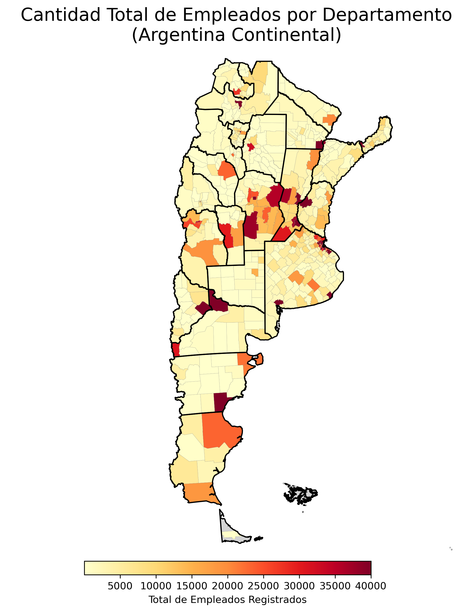
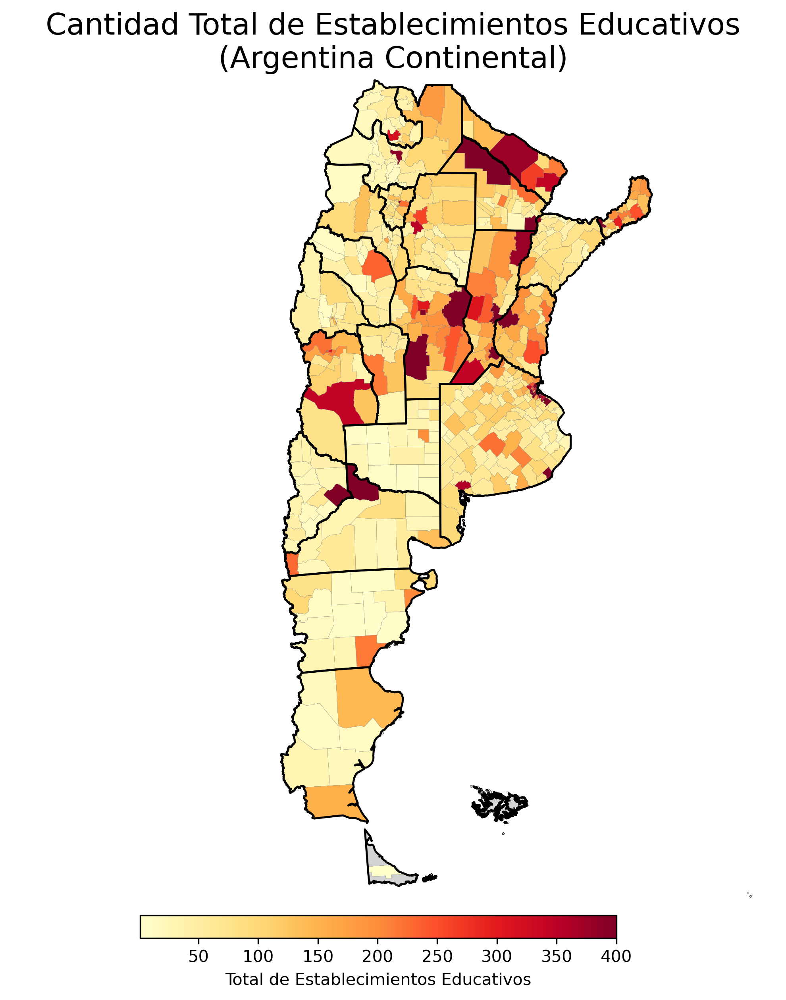
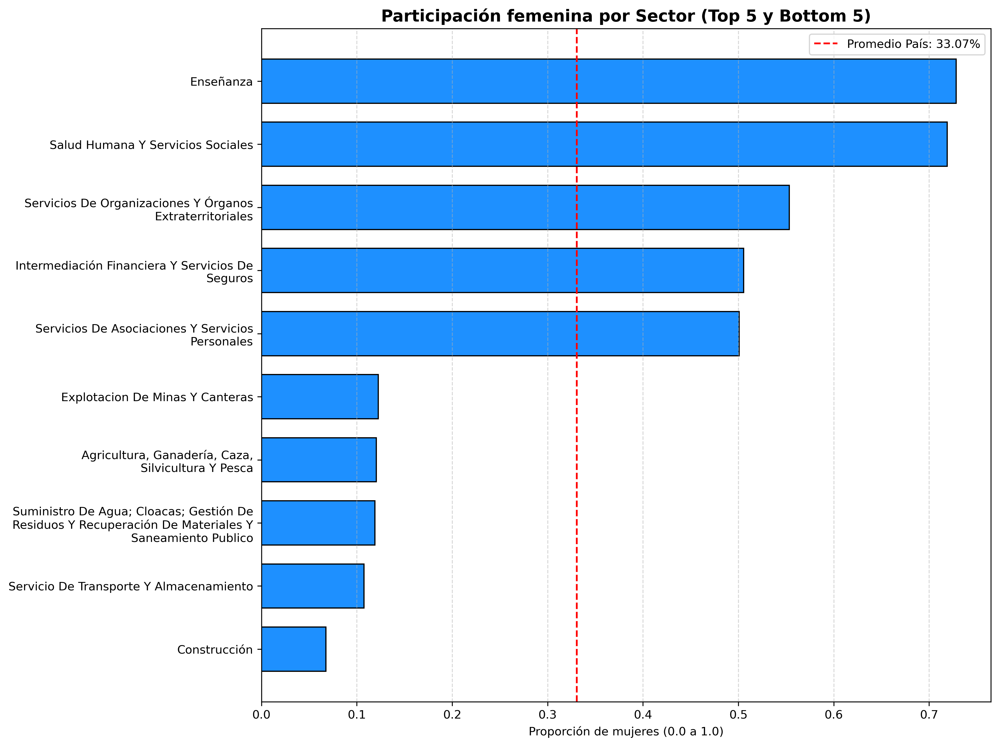
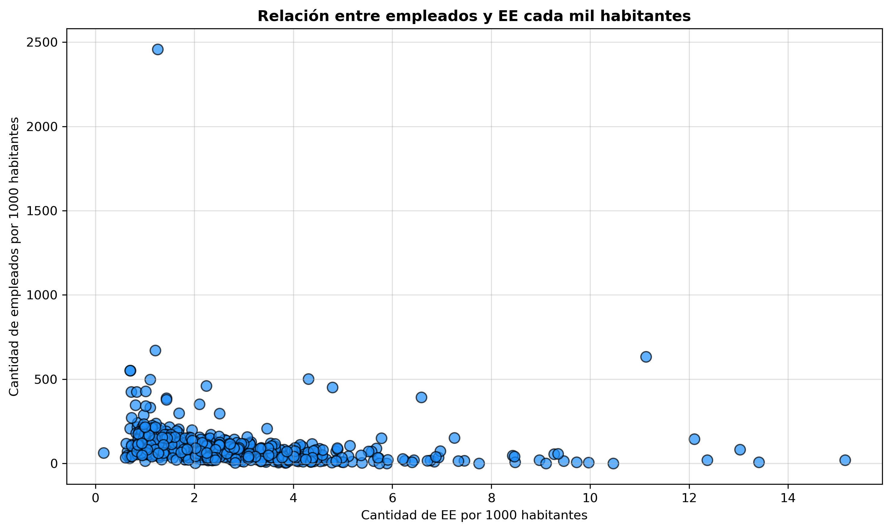

# 🇦🇷 Análisis de Matriz Productiva y Oferta Educativa en Argentina

### Un enfoque de Data Science sobre desigualdades territoriales y brechas estructurales.

Este proyecto analiza la relación entre la infraestructura educativa y la demanda laboral en Argentina utilizando datos oficiales del año 2022. Mediante un pipeline de ingeniería de datos y análisis geoespacial, se buscó responder: **¿Coincide la oferta de escuelas con la demanda de trabajo a lo largo del país?**

---

## 🚀 Resumen Ejecutivo
El análisis integró fuentes heterogéneas (Padrón de Población, Nómina de Establecimientos Educativos y Registro de Empleo) para identificar patrones de distribución. Se detectó una divergencia estructural: mientras la educación posee una **alta capilaridad territorial** (llega a todos lados), el mercado laboral presenta una **centralización extrema** en la zona núcleo del país.

## 📊 Principales Hallazgos y Visualizaciones

### 1. Centralización del Empleo vs. Distribución Educativa
El contraste más fuerte del análisis.
* **Mapa de Empleo:** Se observa un "Corredor Productivo" claro (Buenos Aires, Santa Fe, Córdoba). Fuera de este eje, se detectan "desiertos productivos".
* **Mapa Educativo:** La infraestructura escolar es mucho más homogénea, actuando como ancla demográfica incluso donde el mercado laboral privado es escaso.




### 2. Brecha de Género: "Paredes de Cristal"
Al analizar los sectores productivos (CLAE), confirmamos la segregación horizontal.
* **Sectores Feminizados:** Enseñanza y Salud superan el 70% de participación femenina.
* **Sectores Masculinizados:** Construcción, Transporte y Agroindustria tienen participaciones menores al 15%, limitando el acceso de mujeres a sectores de ingresos altos.



### 3. Falta de Correlación Lineal
Los datos sugieren que **la oferta educativa responde a la demografía, no al mercado laboral**. Al normalizar por habitantes, no existe una correlación directa ($R^2$ bajo) entre la densidad de escuelas y la generación de empleo per cápita departamental.



---

## ⚙️ Ingeniería de Datos & Metodología

El proyecto simula un flujo de trabajo real de Data Engineering:

1.  **ETL & Limpieza (Pandas):**
    * Normalización de datasets gubernamentales (formatos inconsistentes en CSV/Excel).
    * Estandarización de códigos geográficos (INDEC vs. denominaciones locales) y manejo de inconsistencias en IDs de departamentos.
2.  **Modelado de Datos:**
    * Diseño de un esquema relacional normalizado a la **Tercera Forma Normal (3FN)** para garantizar integridad.
3.  **Calidad de Datos (GQM):**
    * Aplicación de metodología **Goal-Question-Metric** para auditar la calidad, cuantificando tasas de error en la geolocalización.
4.  **Análisis SQL Avanzado (DuckDB):**
    * Uso de SQL embebido en Python para agregaciones complejas y rankings.

## 🧠 Showcase de SQL (DuckDB)
Para el análisis se utilizaron **Window Functions** y **CTEs**. Ejemplo de consulta para rankear eficiencia productiva por provincia:

```sql
SELECT 
    d.Provincia_Nombre,
    d.Departamento_Nombre,
    p.Cant_Empresas_Exportadoras,
    RANK() OVER (PARTITION BY d.Provincia_Nombre ORDER BY p.Cant_Empresas_Exportadoras DESC) as Ranking_Provincial
FROM departamentos_info d
JOIN establecimientos_productivos p ON d.Departamento_Id = p.Departamento_Id
WHERE p.Cant_Empresas_Exportadoras > 10;
